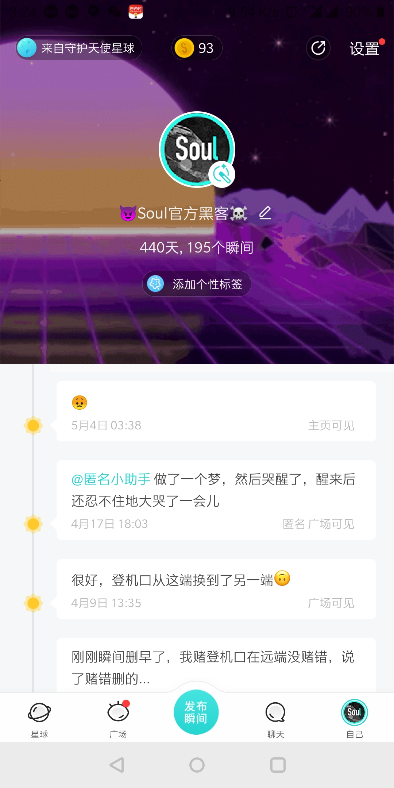

# SoulApp的Python实现
---
(顺便发现可以玩小trick)

如下图，我换了可选范围以外的头像，甚至是官方账号唯一可用头像。

由于此头像太招摇，我被封号了😂

如下图，Python实现的terminal版Soul广场。

目前PySoul已实现大部分功能：
* 设置签名、头像
* 浏览广场
* 浏览主页
* 浏览瞬间、发瞬间、删除瞬间
* 浏览评论、发评论、删除评论
* 点赞，取消点赞
* 关注、取关
* 邀请成为Soulmate、取消Soulmate关系
* ……